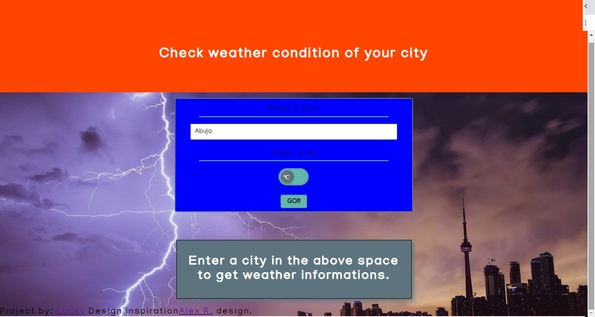

# Restaurant Page

In this project I:

- Used Javascript to build an entire webpage using pure DOM manipulation and Webpack.

# What it does

- When the page loads, you can check out the contact info and menu of the restaurant.

## Built with

- Javascript

## Live Demo

[Click here](https://rawcdn.githack.com/Luckyaremu/weather-app.js/8c305e045ca6d54fe04bebd1587cadf8f7e3d025/dist/index.html)

## Getting Started

- Clone the project to your local machine;
- `cd` into the project directory;
- Run `npm install` to install the necessary modules;
- Run `npm run build`
- Run `npm run serve`.

## Author

Aremu Lucky Baba

Github: [@Luckyaremu](https://github.com/Luckyaremu)

Twitter: [@Luckyaremu](https://twitter.com/luckyaremu)

Linkedin: [Luckyaremu](https://www.linkedin.com/in/lucky-aremu-24807a145/)

## 🤝 Contributing

Contributions, issues and feature requests are welcome! Start by:

- Create github repository
- Cloning the project to your local machine
- `cd` into the project directory
- Run `git checkout -b your-branch-name`
- Make your contributions
- Push your branch up to your working repository
- Open a Pull Request with a detailed description to the future branch of the original project for a review

## Show your support

Give a ⭐️ if you like this project!